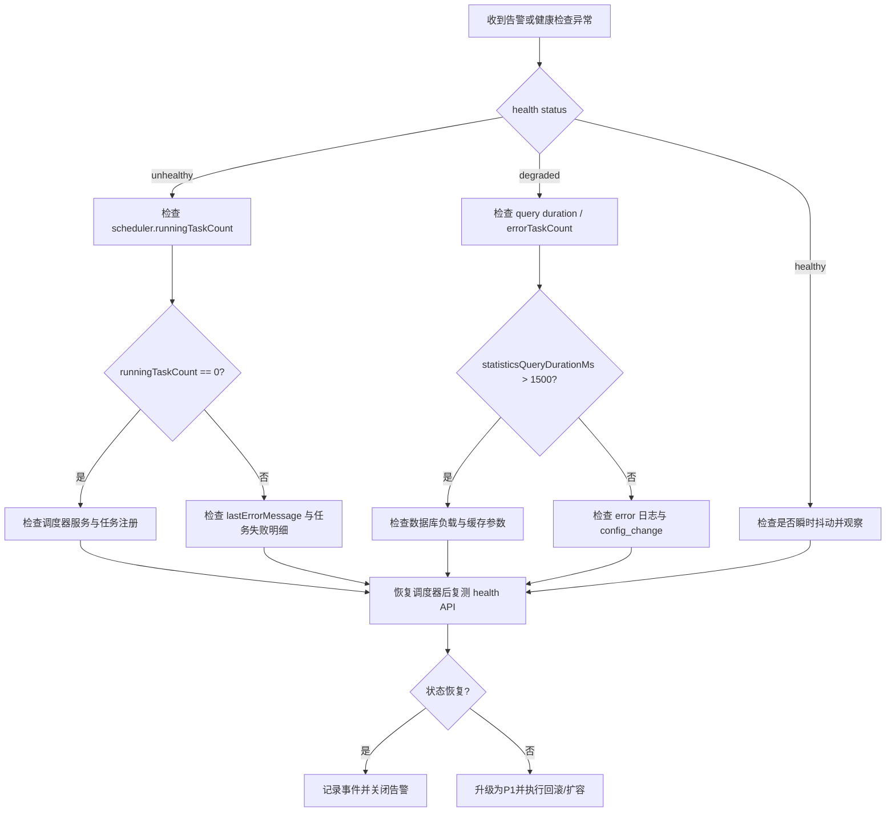

# 记忆衰退系统运维监控指南

## 1. 目标与适用范围

本文档用于指导记忆衰退系统（Decay Algorithm）的日常运维监控、告警处置与故障恢复，适用于以下组件：

- 衰退算法核心监控能力：`src/libs/decay/algorithm.ts`
- API 监控端点：`GET /api/health/memory-system`、`GET /api/memories/stats`

## 2. 系统健康监控指标

### 2.1 健康状态分级

`/api/health/memory-system` 返回 `data.status`：

- `healthy`：系统运行正常
- `degraded`：系统可用但性能/调度异常
- `unhealthy`：关键调度能力不可用

### 2.2 健康判定信号

重点关注返回体 `data.scheduler` 与 `data.performance` 字段：

- `scheduler.available`
- `scheduler.runningTaskCount`
- `scheduler.errorTaskCount`
- `performance.statisticsQueryDurationMs`
- `performance.schedulerLagMs`

健康判定规则（实现逻辑）：

1. 若 `scheduler.available=true` 且 `totalTaskCount>0` 且 `runningTaskCount=0`，状态为 `unhealthy`
2. 若统计查询耗时 `> 1500ms`，状态为 `degraded`
3. 若 scheduler 不可用，状态为 `degraded`
4. 若 `errorTaskCount>0`，状态为 `degraded`
5. 其他情况为 `healthy`

## 3. 性能监控指标

通过算法内置指标快照函数采集（`getDecayAlgorithmMetrics` / `getDecayAlgorithmMetricsReport`）：

### 3.1 吞吐与频率

- `computationCount`
- `frequency.computationsInWindow`
- `frequency.computationsPerSecond`
- `frequency.computationsPerMinute`

### 3.2 时延

- `durations.overall.averageDurationMs`
- `durations.overall.maxDurationMs`
- `durations.byFunction.computeDecayScore.lastDurationMs`

### 3.3 错误

- `errors.totalErrors`
- `errors.byFunction`
- `errors.lastError`

### 3.4 状态迁移稳定性

- `stateTransitions.totalTransitions`
- `stateTransitions.changedTransitions`
- `stateTransitions.byTransition`

## 4. 告警规则与阈值

默认告警规则（`DEFAULT_ALERT_RULES`）：

| 指标 | 默认阈值 | 说明 |
| --- | --- | --- |
| latency | `latencyMs = 100` | `computeDecayScore` 最新时延超阈值触发 |
| error_rate | `errorRate = 0.2` | 窗口内错误率 > 20% 触发 |
| memory_usage | `memoryUsageMb = 256` | 进程堆内存超过阈值触发 |
| state_transition_anomaly | `changeRate > 0.4` 或 `flipCount >= 8` | 状态迁移异常波动 |
| evaluationWindowMs | `60000` | 告警评估窗口（1 分钟） |

严重级别建议：

- `warning`：超过阈值但未达到倍增条件
- `critical`：时延/错误率明显恶化（例如大于阈值 2 倍）

运维动作建议：

- 使用 `updateDecayPerformanceAlertRules` 进行在线阈值调整
- 使用 `silenceDecayPerformanceAlerts(metric?, durationMs?)` 临时静默
- 使用 `restoreDecayPerformanceAlerts(metric?)` 解除静默

## 5. 日志系统与查询方法

### 5.1 日志能力

日志系统支持以下能力：

- 动态配置：`updateDecayAlgorithmLogConfig`
- 内存查询：`queryDecayAlgorithmLogs`
- 文件输出读取：`getDecayAlgorithmLogFileText`
- 清理：`cleanupDecayAlgorithmLogs`

关键日志事件类型：

- `algorithm_start`、`algorithm_end`
- `calculation_step`、`performance_metric`
- `score_change`、`state_transition`
- `config_change`、`query`
- `cleanup`、`rotation`
- `error`

### 5.2 推荐查询策略

按问题类型筛选：

- 时延问题：`event=performance_metric` + 关键字 `latency`
- 异常波动：`event=state_transition`
- 参数变更后异常：`event=config_change` + 时间范围过滤
- 故障回溯：`level=error` + `containsText` + `fromTime/toTime`

## 6. API 监控端点使用方法

### 6.1 健康检查端点

```bash
curl -s "http://localhost:3000/api/health/memory-system"
```

检查重点：

- `data.status` 是否为 `healthy`
- `data.scheduler.runningTaskCount` 是否为正数
- `data.performance.statisticsQueryDurationMs` 是否接近或超过 1500ms

### 6.2 统计端点

```bash
curl -s "http://localhost:3000/api/memories/stats?exportFormat=json&cacheTtlMs=30000"
```

常用参数：

- `fromTimestamp` / `toTimestamp`：时间范围
- `histogramBinSize`：直方图粒度
- `cacheTtlMs`：统计缓存时间
- `exportFormat`：`json` / `csv` / `both`

## 7. 实际运维示例

### 示例 A：晨检（每日）

1. 调用 `/api/health/memory-system`，确认 `status=healthy`
2. 观察 `statisticsQueryDurationMs` 是否稳定（建议 < 800ms）
3. 若 `errorTaskCount>0`，立即查询近期 `error` 日志

### 示例 B：高峰期抖动处理

现象：`latency` 告警频繁出现。

操作：

1. 查询 `performance_metric` 与 `state_transition` 日志
2. 核对 `computeDecayScore.lastDurationMs` 与内存使用
3. 临时上调 `latencyMs` 阈值并设置短时静默（例如 10 分钟）
4. 高峰结束后恢复默认阈值并复盘

### 示例 C：配置变更回归

现象：阈值调整后告警激增。

操作：

1. 检索 `config_change` 日志确认变更时间与内容
2. 对齐该时间点前后 `error_rate` 与 `state_transition_anomaly`
3. 回滚到上一版告警规则并观察 15 分钟窗口

## 8. 常见问题排查指南

### 8.1 健康接口返回 `degraded`

- 检查 `scheduler.available`
- 检查 `errorTaskCount` 和 `lastErrorMessage`
- 检查 `statisticsQueryDurationMs` 是否超过阈值

### 8.2 告警持续不恢复

- 检查是否被静默（`silenced` 状态）
- 检查是否持续真实超阈值
- 检查评估窗口 `evaluationWindowMs` 是否过短导致波动放大

### 8.3 日志量过大

- 降低 `debug` 级别输出
- 开启文件轮转并设置 `maxFileSizeBytes`、`maxFiles`
- 定期执行日志清理与归档

## 9. 故障排除流程图



## 10. 性能优化建议

- 优先优化 `computeDecayScore` 调用路径，关注 `lastDurationMs` 与 `averageDurationMs`
- 对统计接口启用合理 `cacheTtlMs`，避免高频重复聚合
- 将高频日志从 `debug` 下调到 `info`（生产环境）
- 使用分层告警阈值，避免低价值噪声告警

## 11. 容量规划指导

- 以 `computationsPerMinute` 作为吞吐基线，按峰值 2~3 倍预留
- 以 `memoryUsageMb` 告警趋势评估实例内存上限
- 日志容量按 `maxFileSizeBytes * maxFiles` 预留磁盘，并保留额外 30% 冗余
- 状态迁移异常（flip）频繁时，优先扩容而非仅放宽阈值

## 12. 备份与恢复策略

### 12.1 备份对象

- SQLite 数据文件（记忆主数据）
- 衰退相关配置快照（若已落盘）
- 关键运行日志（`error` / `config_change` / `state_transition`）

### 12.2 备份策略

- 每日全量备份 + 每小时增量快照（按业务负载调整）
- 保留最近 7 天热备份和最近 30 天冷备份
- 备份完成后执行可读性校验与恢复演练

### 12.3 恢复策略

1. 隔离故障实例，保留当前日志用于取证
2. 恢复最近可用备份到临时环境校验
3. 校验 `/api/health/memory-system` 与 `/api/memories/stats`
4. 切流回生产并持续观察告警窗口至少 30 分钟

---

维护建议：每次告警规则或监控字段变更后，同步更新本文档中的阈值与排障步骤。
