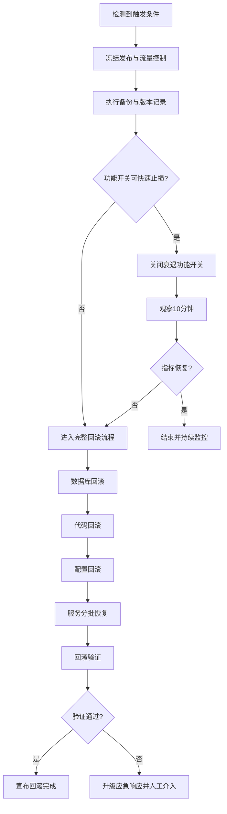

# 记忆衰退算法回滚计划

## 1. 文档范围

- 适用变更：`implement-memory-decay-algorithm`
- 适用系统：数据库（SQLite）、衰退算法、调度器、API/服务配置
- 目标：在记忆衰退功能异常时，快速、安全地恢复到稳定版本

## 2. 回滚触发条件

满足任一条件立即触发回滚流程：

1. 服务关键指标异常：错误率持续高于基线 2 倍且持续 10 分钟以上。
2. 数据一致性异常：出现 `score` 计算异常（越界、批量写入失败、状态错误分类）。
3. 数据库异常：迁移后查询性能显著下降或出现锁冲突导致核心请求超时。
4. 调度器异常：衰退任务重复执行、无法停止或导致明显内存增长。
5. 功能开关失效：无法通过开关停用新功能，且持续影响线上可用性。

## 3. 回滚准备步骤

1. 宣布变更冻结，暂停发布与迁移任务。
2. 确认回滚负责人、数据库操作人、服务恢复观察人。
3. 记录当前版本信息：Git commit、部署批次、配置版本。
4. 备份当前数据库文件：`kv.db`、`kv.db-wal`、`kv.db-shm`。
5. 导出当前关键观测指标快照（错误率、延迟、任务执行日志）。

## 4. 数据库回滚步骤

> 设计约束要求数据库变更可逆。`score` 字段回滚采用“停写 -> 备份 -> 重建表”方式，保证兼容性。

1. 停止写入流量或切换只读模式，避免并发写冲突。
2. 二次确认数据库备份可用。
3. 使用事务执行表结构回滚（移除 `score` 字段与相关索引）。

```sql
BEGIN TRANSACTION;

DROP INDEX IF EXISTS idx_memories_score;

CREATE TABLE memories_rollback (
  key TEXT PRIMARY KEY,
  summary TEXT NOT NULL,
  text TEXT NOT NULL,
  meta TEXT NOT NULL,
  links TEXT NOT NULL,
  created_at INTEGER NOT NULL
);

INSERT INTO memories_rollback (key, summary, text, meta, links, created_at)
SELECT key, summary, text, meta, links, created_at
FROM memories;

DROP TABLE memories;
ALTER TABLE memories_rollback RENAME TO memories;

COMMIT;
```

4. 执行快速数据校验：记录数一致、主键唯一、关键查询可执行。
5. 若事务失败，回退到备份文件并重新挂载数据库。

## 5. 代码回滚步骤

1. 切换到回滚基线分支（旧版本稳定分支）。
2. 回退以下功能代码：
   - 衰退得分计算逻辑
   - 定时调度器初始化与执行逻辑
   - 状态分类与过滤逻辑
3. 重新构建并部署服务二进制/运行包。
4. 检查服务启动日志，确认无新功能初始化痕迹。

## 6. 配置回滚步骤

1. 将衰退算法功能开关设置为关闭（如 `MEMORY_DECAY_ENABLED=false`）。
2. 移除或置空衰退任务相关配置（执行间隔、批大小、阈值参数）。
3. 恢复回滚前的配置版本并重新加载配置。
4. 校验运行时配置生效状态（通过管理接口或启动日志）。

## 7. 服务恢复步骤

1. 按“数据库 -> 应用服务 -> 接入层”顺序恢复。
2. 先恢复单实例并做健康检查，再逐步扩容到完整集群。
3. 恢复外部流量，采用分批放量（10% -> 50% -> 100%）。
4. 持续观察 30 分钟，确认无错误扩散后宣布回滚完成。

## 8. 回滚验证方法

### 8.1 功能验证

- 新增/读取记忆操作成功，无 `score` 相关错误。
- 衰退任务不再触发（无定时任务执行日志）。
- 状态查询行为回到旧版本预期。

### 8.2 数据验证

- `memories` 表结构不包含 `score` 字段。
- 数据总量与回滚前一致（允许回滚窗口内新增数据按策略处理）。
- 关键查询延迟恢复到基线范围。

### 8.3 稳定性验证

- 服务错误率恢复至基线。
- 内存/CPU 无持续异常抬升。
- 无新增数据库锁等待告警。

## 9. 回滚时间估算

| 阶段 | 预计耗时 |
|---|---|
| 回滚准备 | 5-10 分钟 |
| 数据库回滚 | 10-20 分钟 |
| 代码与配置回滚 | 10-15 分钟 |
| 服务恢复与验证 | 15-30 分钟 |
| 总计 | 40-75 分钟 |

## 10. 回滚风险分析

1. 数据窗口风险：回滚期间新增写入可能丢失或重复，需要提前停写并登记窗口。
2. 版本漂移风险：代码、配置、数据库不一致会导致二次故障，必须按顺序执行。
3. 备份不可用风险：备份损坏会放大恢复时间，需在回滚前执行可读性校验。
4. 流量恢复风险：一次性全量恢复可能触发雪崩，必须分批放量。

## 11. 回滚后监控

回滚完成后至少监控 24 小时：

- 应用指标：错误率、P95/P99 延迟、重启次数。
- 数据库指标：锁等待、慢查询、写入失败率。
- 任务指标：确认无衰退任务执行记录。
- 业务指标：记忆读写成功率与检索命中率。

## 12. 紧急联系人列表

> 使用角色占位，执行时替换为当值人员与联系方式。

| 角色 | 职责 | 联系方式 |
|---|---|---|
| 值班负责人（Incident Commander） | 决策与流程推进 | 待填写 |
| 数据库负责人（DBA） | 执行数据库回滚 | 待填写 |
| 服务负责人（Backend Oncall） | 代码/配置回滚与发布 | 待填写 |
| 监控负责人（SRE Oncall） | 指标观察与告警处置 | 待填写 |
| 业务沟通人（PM/运营） | 外部状态同步 | 待填写 |

## 13. 回滚流程图



## 14. 回滚检查清单

### 14.1 执行前

- [ ] 已确认触发条件并获得回滚指令
- [ ] 已完成数据库文件备份（含 WAL/SHM）
- [ ] 已记录当前版本与配置快照
- [ ] 已通知相关角色进入应急通道

### 14.2 执行中

- [ ] 已冻结发布并控制写流量
- [ ] 已完成数据库结构回滚
- [ ] 已完成代码版本回退
- [ ] 已完成配置回退并验证生效
- [ ] 已完成服务分批恢复

### 14.3 执行后

- [ ] 功能验证通过
- [ ] 数据验证通过
- [ ] 稳定性验证通过
- [ ] 已更新事件复盘记录
- [ ] 已安排 24 小时持续监控
