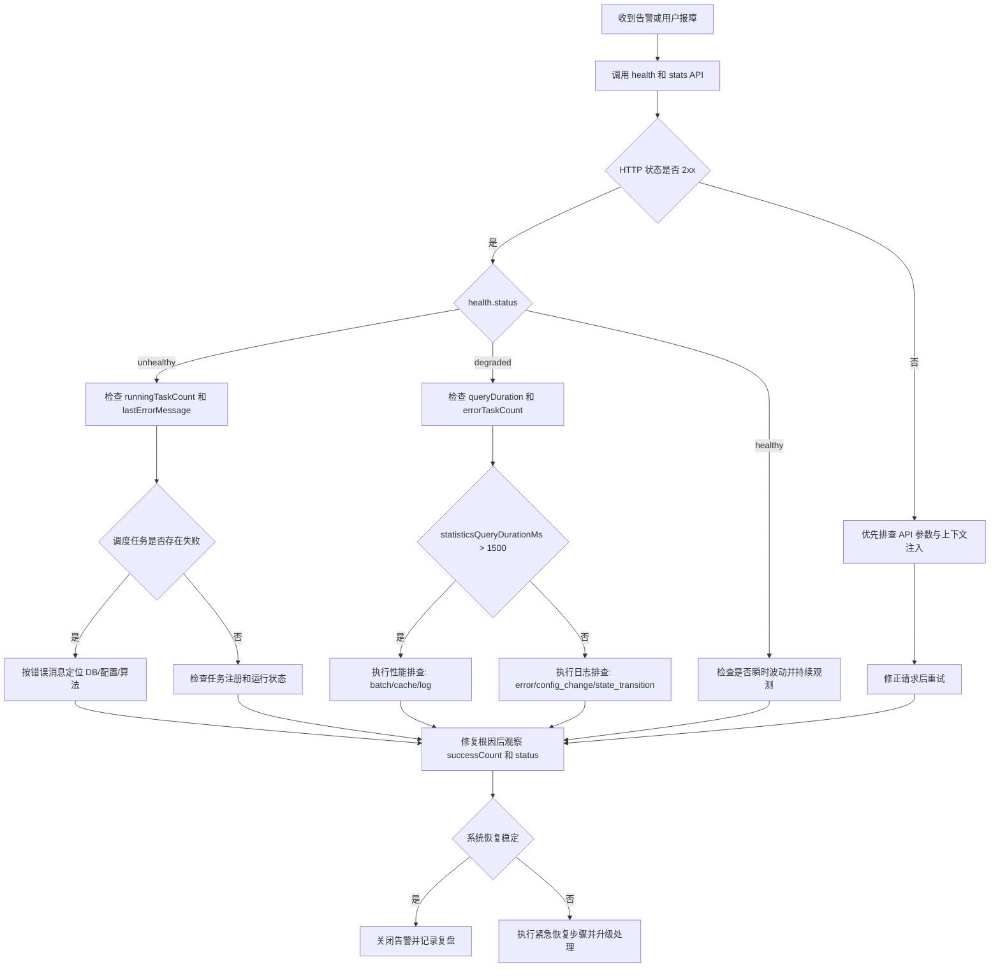

# 记忆衰退系统故障排除手册

## 1. 适用范围

本文用于定位和恢复记忆衰退系统中的常见故障，覆盖以下组件：

- 数据库（SQLite）
- 衰退算法计算链路
- 调度器
- 统计与健康 API
- 配置加载与热重载

## 2. 快速分诊入口

先执行以下最小检查：

```bash
curl -s "http://localhost:3000/api/health/memory-system"
curl -s "http://localhost:3000/api/memories/stats?exportFormat=json"
```

优先关注：

- `data.status`（`healthy` / `degraded` / `unhealthy`）
- `data.scheduler.runningTaskCount`
- `data.scheduler.lastErrorMessage`
- `data.performance.statisticsQueryDurationMs`

## 3. 常见错误代码与含义

说明：当前实现主要返回错误消息，未统一暴露机器错误码。下表提供故障排查用标准码（文档码），并映射到实际错误信号。

| 文档码 | 实际错误消息/信号 | 组件 | 含义 | 首要动作 |
| --- | --- | --- | --- | --- |
| DECAY-API-400-INVALID-QUERY | `Invalid query parameter \`field\`: expected integer` | API | 查询参数类型错误 | 修正请求参数为整数 |
| DECAY-API-400-EXPORT-FORMAT | `Invalid query parameter \`exportFormat\`: expected json,csv,both` | API | 导出格式非法 | 改为 `json/csv/both` |
| DECAY-API-500-DB-UNAVAILABLE | `Statistics db unavailable from request context` | API/服务注入 | 运行时上下文缺失 DB | 检查服务装配与上下文键 |
| DECAY-ALG-400-TIME-DECAY-RANGE | `config.weights.minTimeDecayFactor must be within [0.95, 1.0]` | 算法 | 时间衰退因子越界 | 回退到合法区间 |
| DECAY-ALG-400-USAGE-BOOST-RANGE | `usageBoost must be within [0, 10]` | 算法 | 使用提升越界 | 修正配置或输入 |
| DECAY-ALG-400-STRUCTURE-BOOST-RANGE | `structureBoost must be within [0, 5]` | 算法 | 结构提升越界 | 修正配置或输入 |
| DECAY-PROC-404-MEMORY-NOT-FOUND | `Memory not found: <key>` | 批处理 | 目标记忆不存在或并发删除 | 复查 key、重试批次 |
| DECAY-PROC-408-BATCH-TIMEOUT | `Batch transaction timed out after <ms>ms` | 批处理/数据库 | 单批事务超时 | 降低 batch、提高 timeout、查锁等待 |
| DECAY-PROC-409-OPTIMISTIC-LOCK | `OptimisticLockConflictError` | 批处理并发 | 乐观锁冲突 | 增加重试与退避 |
| DECAY-SCH-500-TASK-RUNTIME-FAIL | `failureCount > 0` 且 `lastErrorMessage != null` | 调度器 | 调度任务持续失败 | 修复底层错误后观察恢复 |
| DECAY-CONFIG-400-INVALID-JSON | 配置文件 JSON 解析失败 | 配置 | 热重载输入非法 | 回滚为合法 JSON 后重载 |

## 4. 数据库问题排查

### 症状

- 统计接口 500
- 批处理超时或失败
- 调度器失败计数持续增长

### 排查步骤

1. 确认 `memories` 表存在且结构完整（特别是 `meta`、`score` 字段）。
2. 检查 SQLite 锁竞争与超时（观察事务持续时间和并发连接数）。
3. 复查数据库路径与运行进程权限。
4. 对高负载场景临时缩小 `batchSize`，缩短单事务持锁时长。
5. 若出现损坏或缺表，走紧急恢复流程（见第 11 节）。

## 5. 算法计算问题排查

### 症状

- 出现 `TypeError` / `RangeError`
- 分数异常跳变
- 状态迁移波动异常

### 排查步骤

1. 定位错误消息中的参数名（如 `minTimeDecayFactor`、`usageBoost`）。
2. 对照合法范围：时间衰退 `[0.95, 1.0]`，使用提升 `[0,10]`，结构提升 `[0,5]`。
3. 检查输入数据质量：`last_accessed_at`、`access_count`、链接权重是否为有限值。
4. 对比 `getDecayAlgorithmMetricsReport()` 的 `errors`、`stateTransitions`。
5. 配置变更后异常时，优先回滚到上一个稳定配置并复测。

## 6. 调度器问题排查

### 症状

- `status=unhealthy`
- `runningTaskCount=0` 且 `totalTaskCount>0`
- `failureCount` 持续上升

### 排查步骤

1. 读取调度快照，确认任务已注册且非暂停状态。
2. 检查 `lastErrorMessage`，优先处理根因（如 DB 缺表、配置非法）。
3. 验证任务间隔与批量参数是否过激（过小间隔 + 大批次会放大失败）。
4. 修复后观察 `successCount > 0` 且 `lastErrorMessage === null`。
5. 必要时重启调度器并执行一次人工健康检查。

## 7. API 问题排查

### 常见场景

- `/api/memories/stats` 返回 400
- `/api/memories/stats` 或 `/api/health/memory-system` 返回 500

### 排查步骤

1. 对 400：检查参数类型与 `exportFormat` 枚举。
2. 对 500：检查请求上下文是否注入 `kvMemoryService.db`。
3. 核对 API 响应中的 `error.message` 与日志时间线是否一致。
4. 先用最小参数请求验证基础可用性，再逐步增加筛选参数。

## 8. 性能问题排查

### 关键信号

- `statisticsQueryDurationMs > 1500`
- 算法时延上升（`lastDurationMs`、`averageDurationMs`）
- 批处理超时与重试次数增加

### 排查步骤

1. 识别瓶颈位置：API 聚合慢、算法计算慢、还是事务提交慢。
2. 降低 `batchSize`，避免单批处理过重。
3. 提高统计接口 `cacheTtlMs`，减少高频聚合。
4. 限制高频 debug 日志，避免 I/O 放大。
5. 按峰值吞吐评估扩容，避免仅靠放宽阈值掩盖问题。

## 9. 配置问题排查

### 常见场景

- 热重载失败
- 重载后行为异常
- 配置文件监听未生效

### 排查步骤

1. 先校验 JSON 语法和关键字段类型。
2. 调用重载后确认运行时配置是否变更到预期值。
3. 若重载失败，确认系统保留旧配置（容错行为）。
4. 检查配置变更事件：`config_reloaded`、`config_reload_failed`、`watch_started`。
5. 对异常版本执行回滚，恢复最后稳定配置。

## 10. 日志分析指南与调试方法

### 日志分析

建议按事件类型分层过滤：

- 调度失败：`error` + `scheduler`
- 计算异常：`error` + `calculation_step`
- 波动问题：`state_transition`
- 变更回溯：`config_change`

建议关注字段：

- 时间窗口（故障前 5 分钟到故障后 10 分钟）
- 错误消息关键字
- 同时段健康状态与统计指标

### 调试工具和方法

- HTTP 检查：`curl` 调用健康/统计端点
- 指标快照：`getDecayAlgorithmMetricsReport()`
- 调度快照：`scheduler.getTaskSnapshot(taskId)` / `scheduler.getSnapshot()`
- 回归验证：

```bash
bun test tests/decay.e2e.test.ts
bun test tests/decay.scheduler.test.ts
```

- 并发问题复现：

```bash
bun test tests/decay.concurrent.test.ts
```

## 11. 紧急恢复步骤（P1）

1. **止血**：暂时降低调度频率或暂停相关任务，防止错误扩散。
2. **保全现场**：导出最近日志与健康响应，记录时间线。
3. **快速诊断**：判定主因（DB、配置、调度、算法）。
4. **恢复基础能力**：
   - DB 缺表/损坏：恢复最近可用备份并校验表结构。
   - 配置损坏：回滚到最后稳定配置并重载。
5. **灰度验证**：观察至少一个完整调度窗口（建议 15 分钟）。
6. **恢复流量**：确认 `status` 稳定且错误率回落后恢复正常频率。
7. **复盘**：记录根因、触发条件、修复动作与预防项。

## 12. 实际故障案例

### 案例 A：调度器启动后持续失败

- 现象：`failureCount > 0`，健康状态退化。
- 根因：调度器指向空 DB 文件，缺少 `memories` 表。
- 处置：创建表并补入最小样本数据后，观察到 `successCount > 0` 且 `lastErrorMessage === null`。
- 预防：上线前执行 DB 结构预检。

### 案例 B：配置热重载输入非法 JSON

- 现象：重载接口失败。
- 根因：配置文件语法错误。
- 处置：修复 JSON 后重载；系统保持旧配置，业务未被破坏。
- 预防：配置发布前增加 JSON 校验步骤。

### 案例 C：统计接口参数错误导致 400

- 现象：`/api/memories/stats?exportFormat=xml` 返回 400。
- 根因：`exportFormat` 非法枚举值。
- 处置：改为 `json/csv/both`。
- 预防：客户端 SDK 固化参数枚举。

## 13. 逐步排查流程图


